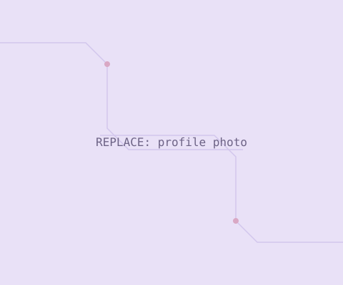

# Tlangelani D. Tembe — Engineering E-Portfolio

A single-page e-portfolio built with plain HTML, CSS and JavaScript (no build
tools, no frameworks) so it's easy to edit and deploys instantly on Vercel.

**Files:**
```
portfolio/
├── index.html      ← all page content and structure
├── style.css       ← colours, fonts, layout (edit palette at the top)
├── script.js       ← typing effect, scroll animations, gallery lightbox
├── README.md       ← this file
└── assets/
    ├── images/     ← put your photos here
    ├── videos/     ← put your video clips here
    └── documents/  ← put PDFs (reports, certificates) here
```

---

## 1. Preview it locally (optional)

You can just double-click `index.html` to open it in a browser. If images
don't load that way, run a tiny local server instead:

```bash
cd portfolio
python3 -m http.server 8000
```

Then open `http://localhost:8000` in your browser.

---

## 2. Editing the content

Everything you'll want to change day-to-day lives in **`index.html`**. It's
organised into clearly labelled sections in this order: Home, About, Skills,
Projects, Artefacts, Contact. Search for `EDIT ME` comments — those mark the
spots you're most likely to change.

### Change the typed welcome text
This one trips people up: the text you see typing itself out on the
homepage is **not** stored in `index.html`. JavaScript writes over that
part of the page as soon as it loads, so editing it in `index.html` won't
do anything. Open **`script.js`** instead, find the `lines` array near the
top (inside the `typeEffect` function), and edit the text of each line:

```js
const lines = [
  { text: "$ whoami", cls: "prompt" },
  { text: "Tlangelani D. Tembe", cls: "type-name" },
  { text: "$ role --current", cls: "prompt" },
  { text: "Electrical & Computer Engineering student, UCT", cls: "" },
  ...
];
```

### Edit your bio, projects, skills, contact details
Open **`index.html`** and edit the text directly inside each `<section>`.
Each project is one `<article class="project-card">` block — copy, paste,
and edit one to add a new project.

### Add a gallery item (Artefacts section)
Copy one `<div class="gallery-item">` block in the Artefacts section, then
change the file path and caption:

```html
<div class="gallery-item reveal from-up" data-full="assets/images/your-photo.jpg" data-type="image">
  
  <div class="gallery-cap">Your caption here</div>
</div>
```

For a video tile, set `data-type="video"` and point both paths at an `.mp4`
file in `assets/videos/`.

### Update your colour palette
Open **`style.css`** — the very top has a `:root { ... }` block with named
colours (`--purple-panel`, `--pink-panel`, `--grey-bg`, `--accent`, etc.).
Change the hex values there and the whole site updates.

---

## 3. Adding images

1. Save your image file into `assets/images/` (e.g. `assets/images/profile.jpg`).
2. Keep the filename simple — lowercase, no spaces (use `project-cordic.jpg`, not `Project Cordic.jpg`).
3. In `index.html`, find the placeholder you want to replace and update the `src`:

```html

```
becomes
```html

```

4. Always keep a short, accurate `alt="..."` description — it's used by
   screen readers and improves accessibility.

**Tip:** compress large photos before uploading (e.g. with
[squoosh.app](https://squoosh.app)) so the site stays fast — aim for under
500KB per image.

---

## 4. Adding videos

1. Save your `.mp4` file into `assets/videos/`.
2. Replace an image placeholder with a `<video>` tag, for example in a
   project card:

```html
<div class="project-media">
  <video src="assets/videos/your-demo.mp4" controls muted playsinline poster="assets/images/your-poster.jpg"></video>
</div>
```

3. For the Artefacts gallery, add a gallery item with `data-type="video"`
   (see section 2 above) — clicking the tile will play it in the lightbox.

**Tip:** keep clips short (under a minute) and compress them (HandBrake,
or `ffmpeg -crf 28`) so they load quickly for markers/viewers.

---

## 5. Stacked media (multiple photos/videos per project)

Each project card shows several photos/videos as a layered deck — you can
see the edges of the items behind the front one, and **‹ ›** arrow buttons
(plus the dots underneath) let you step through them with a smooth,
cinematic shuffle transition. Videos autoplay (muted) as soon as they
reach the front of the stack. This is the `.media-stack` component.
Structure:

```html
<div class="project-media">
  <div class="media-stack">
    <div class="stack-frame">
      <div class="stack-item">
        
      </div>
      <div class="stack-item">
        <video muted playsinline controls preload="metadata"
               poster="assets/images/your-poster.jpg"
               src="assets/videos/your-clip.mp4"></video>
      </div>
      <!-- add as many .stack-item blocks as you like -->
    </div>
    <button class="stack-arrow prev" type="button" aria-label="Previous media">‹</button>
    <button class="stack-arrow next" type="button" aria-label="Next media">›</button>
    <div class="stack-dots"><span></span><span></span></div>
  </div>
</div>
```

**To add another item to a stack:** copy one `.stack-item` block, update
its `src`, and add one more `<span></span>` inside `.stack-dots` so the
dot indicator matches the number of items. No JavaScript editing needed —
the cycling behaviour (including autoplay-on-front for videos) picks up
new items automatically.

**Grouping photos into a stack:** the site groups your uploaded photos
into stacks by matching filenames — e.g. `IEEE.jpg`, `IEEE2.jpg`, and
`IEEE4.jpg` (same base name, different number) all live inside one IEEE
stack; `Work.jpg`, `Work2.jpg`, `Work3.jpg` form the Work stack in
Artefacts; `Interests.jpg` through `Interests7.jpg` form the Interests
stack. If you add a new photo that continues one of these series (say,
`IEEE5.jpg`), just drop it into `assets/images/` and add one more
`.stack-item` + one more dot in that stack's HTML block, following the
same pattern. A photo with a name that doesn't match any existing group
(no shared base name) is best added as its own single image, or as the
start of a brand-new stack if you have more than one of it.

**Optional captions:** add `data-caption="Your label"` to any
`.stack-item` and a small caption badge will show in the top-left corner
whenever that item is at the front of the stack — see the Interests or
Leadership stacks in `index.html` for examples.

**Video posters:** browsers show a blank first frame until a video is
played. Give each video a `poster="..."` image (a still frame) so it
looks good before anyone presses play. You can grab a frame with:
```bash
ffmpeg -i assets/videos/your-clip.mp4 -ss 00:00:01 -vframes 1 assets/images/your-poster.jpg
```

**Animating a static diagram ("data flow" effect):** if you have a
diagram (like a block diagram or flowchart) instead of an actual video,
you can give it a subtle animated "data flowing through it" look without
needing a real video file. Wrap the image in a `.project-media
flow-diagram` container:
```html
<div class="project-media flow-diagram">
  
</div>
```
This adds a soft light streak that continuously sweeps across the image
(see `.flow-diagram` in `style.css` to adjust its speed or colour). It's
used on the StarCore-1 block diagram as an example.

---

## 6. Adding your CV

Save your CV as a PDF into `assets/documents/CV.pdf` (exactly that name,
or update the paths mentioned below to match your filename).

The site doesn't download your CV immediately — clicking **"View CV"**
(in the hero) or **"View"** (in the About section) opens it in an
in-page viewer first, with its own **Download** button inside. Both
buttons use the `view-cv-trigger` class to open that viewer; if you add
another CV link elsewhere on the site, give it the same class and it
will open the same viewer automatically. The viewer and its Download
button both point to `assets/documents/CV.pdf` — update both paths in
`index.html` if you use a different filename.

---

## 7. Publishing with GitHub + Vercel

This gets your portfolio onto a live, single link you can hand in — and
every time you push a change to GitHub, Vercel automatically redeploys it.

### Step 1 — Create a GitHub repository
1. Go to [github.com](https://github.com) and sign in (create a free account if needed).
2. Click the **+** icon (top right) → **New repository**.
3. Name it something like `doris-eportfolio`, keep it **Public**, and click **Create repository**.

### Step 2 — Upload your site to GitHub
The easiest way, with no command line:
1. On your new repo's page, click **"uploading an existing file"**.
2. Drag in the whole `portfolio` folder contents (`index.html`, `style.css`,
   `script.js`, `README.md`, and the `assets` folder with everything inside it).
3. Scroll down, add a commit message like "Initial portfolio upload", and click **Commit changes**.

*(If you're comfortable with Git, this also works from a terminal:)*
```bash
cd portfolio
git init
git add .
git commit -m "Initial portfolio upload"
git branch -M main
git remote add origin https://github.com/YOUR-USERNAME/doris-eportfolio.git
git push -u origin main
```

### Step 3 — Deploy on Vercel
1. Go to [vercel.com](https://vercel.com) and sign up/sign in — choose **"Continue with GitHub"** so the two are linked.
2. Click **Add New… → Project**.
3. Select your `doris-eportfolio` repository and click **Import**.
4. Framework preset: leave it as **"Other"** (this is a plain static site — no build step needed).
5. Click **Deploy**. Vercel will give you a live URL within about a minute, e.g. `https://doris-eportfolio.vercel.app`.

That URL is your single hand-in link.

### Step 4 — Making future edits
1. Edit files locally (or directly in GitHub's web editor — open a file in
   your repo and click the pencil ✏️ icon).
2. Commit the change.
3. Vercel automatically redeploys the site within a minute or two — no
   extra steps needed.

---

## 8. Before you submit — quick checklist

- [ ] Replace all placeholder images/videos with your own
- [ ] Update the email, LinkedIn and GitHub links in the Contact section
- [ ] Proofread all text for spelling and grammar
- [ ] Test the site on your phone (open the Vercel link) to check it looks right on mobile
- [ ] Click every nav link and project link to make sure nothing is broken
- [ ] Confirm the live Vercel link opens correctly in a private/incognito browser window
